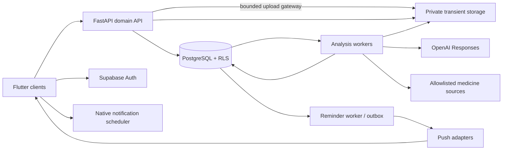

# MedLM AI architecture

> Phase 1 implementation update (2026-09-24): the foundation is now implemented. See [PHASE_1_REPORT.md](PHASE_1_REPORT.md), [current API contract](contracts/openapi.json) and [scope decisions](docs/adr/0001-phase-one-boundaries.md). The remaining design below describes future behavior, not implemented clinical functionality.

Status: Phase 1 foundation implemented; clinical features remain proposed. Research date: 2026-09-24. Recommendations below are design decisions, not claims of clinical validation or deployment readiness.

Phase 0 final review: **ARCHITECTURE APPROVED FOR IMPLEMENTATION**, subject to the external dependencies and release gates below. This is approval of the design for staged engineering, not approval to launch, a guarantee of medical correctness, or authorization to start Phase 1 automatically.

## Repository and environment inspection

The repository contained only `.git`, with no commits on `master`, source, dependencies, tests, or existing AGENTS.md. No ancestor AGENTS.md was found in the inspected path hierarchy. The host is Windows with PowerShell.

| Observation | Implication |
| --- | --- |
| Flutter and Dart launchers at `C:\src\flutter\bin` | Cached SDK metadata reports Flutter 3.41.7 stable / Dart 3.11.5; this is not a successful SDK health check |
| `flutter --version` produced no output before cancellation; chained doctor did not complete | Run and diagnose `flutter doctor -v` during environment setup; toolchain readiness remains unverified |
| Git 2.54.0.windows.1; Node 24.18.0 | Available; Node is optional tooling, not the API runtime |
| `uv` is on PATH; Python and python3 were not found on PATH | `uv python list --only-installed` failed initializing its cache; Python inventory is unverified |
| Android Studio directory, Java and adb launchers found | Android SDK, licenses, emulator and JDK compatibility still need checking; adb found in a scrcpy installation |
| Docker, psql and Supabase CLI not found on PATH | Do not infer they are absent elsewhere; install/configure only in the implementation setup phase |
| Windows host | Apple signing/build/test work requires macOS runners and physical Apple devices |

No SDK upgrades, dependency installations, services, credentials, database migrations or cloud resources were created.

## Decisions and boundaries

Use one Flutter client for Android, iOS, web, Windows and macOS, with adaptive layouts and native capability adapters. Flutter officially supports these deployment families; pin a tested SDK and OS matrix during setup rather than assuming the local SDK matches current documentation. Flutter Web suits an authenticated application; use ordinary HTML for any future public, indexed educational/marketing pages. [Flutter platforms](https://docs.flutter.dev/reference/supported-platforms), [Web FAQ](https://docs.flutter.dev/platform-integration/web/faq).

| Layer | Recommendation | Reason / constraint |
| --- | --- | --- |
| Client | Flutter/Dart; Material 3 foundation; Riverpod and go_router candidates | Shared feature code, explicit state, adaptive navigation; package versions and licenses must be checked before adoption |
| Local state | Native SQLite behind a repository interface; OS-protected encryption key | Offline dose records and scheduled reminders; encrypted database package support needs a five-platform spike |
| Browser state | Memory by default; explicitly enabled minimal IndexedDB cache | Browser storage lacks the native device security boundary; no image caching |
| API | Python 3.12+ compatibility baseline, FastAPI, Pydantic 2, SQLAlchemy 2, Alembic, uv | Typed validation, versioned contracts, transactional domain services; pin compatible versions later |
| Identity and data | Supabase Auth, managed PostgreSQL, private Supabase Storage | Managed primitives; FastAPI is the sole medical-data API |
| Durable work | Separate Python workers with PostgreSQL jobs, leases and transactional outbox | Small initial operational footprint; replace queue behind interface if measured scale requires it |
| AI | Server-side OpenAI Responses API, `gpt-6-astra` | Extraction and evidence-grounded explanation, never medical authority |
| Retrieval | DailyMed / RxNorm / openFDA adapters; regional and licensed adapters | Explicit country and source scope; no scraped pharmacy sites as primary evidence |
| Notifications | Native local scheduling; FCM/APNs and Web Push where supported | Local reminders work without a server connection; push remains best effort |
| Hosting | Static web CDN, container API and independent worker/scheduler processes in selected region | Private connectivity where available; separate development, staging and production |

FastAPI deployment requires explicit handling of process lifetime, replication and startup work; durable jobs must survive API restarts. PostgreSQL RLS provides a second authorization layer but owners and privileged roles can bypass it. [FastAPI deployment](https://fastapi.tiangolo.com/deployment/concepts/), [PostgreSQL RLS](https://www.postgresql.org/docs/current/ddl-rowsecurity.html).

## Component architecture



The server owns identity matching, evidence validation and prescription confirmation. The model cannot create medications, activate schedules, call arbitrary URLs, or write database records. Application modules are identity, uploads, analysis, evidence/catalog, prescriptions, medications, reminders, privacy and audit. Start as a modular monolith with separate worker processes, not independently deployed domain microservices.

Auth issues short-lived JWTs; native clients use bearer tokens. The web app uses a same-origin backend session with HttpOnly cookies and CSRF protection. Domain tables stay in a private database schema; client medical-data access never depends on hiding table names. See [SECURITY.md](SECURITY.md).

Android, iOS and web share the same Flutter feature/domain code, generated API contract and FastAPI domain backend; Windows/macOS remain supported targets. Browser token handling is an adapter: FastAPI owns the web PKCE exchange and refresh lifecycle, and Flutter Web does not use a browser Supabase session for clinical calls. Route `/v1` through the same public origin as the static app. Native auth uses Supabase SDK tokens with server-side session revocation checks.

Uploads use a bounded streaming gateway in FastAPI with short-lived, single-use application tickets; storage remains private and backend-only. This corrects the assumption that Supabase's signed upload URL can implement the proposed five-minute ticket: its documented validity is two hours. Phase 1 must measure gateway memory/time limits and deletion behavior before considering a direct-upload optimization. [Supabase signed upload URL](https://supabase.com/docs/reference/javascript/file-buckets-createsigneduploadurl).

## Proposed repository structure

```text
/
  AGENTS.md and seven design documents
  apps/medlm/                 # Flutter app; feature modules; platform runners
    lib/{app,design_system,features,platform,data}/
    test/ and integration_test/
  services/api/              # routes, auth, typed contracts
  services/worker/           # analysis, deletion, reminders, source refresh
  packages/backend_domain/  # shared Python domain logic, repositories, adapters
  contracts/                # generated OpenAPI and Dart client, schema versions
  database/migrations/      # Alembic is the sole domain migration authority
  evals/                    # consented/synthetic fixtures and safety evaluations
  infra/                    # container, environments, CI, deployment definitions
  docs/{adr,runbooks}/       # decisions, source licenses, incident procedures
```

These directories are proposed, not scaffolded. Supabase-managed auth/storage migrations remain provider-owned; do not duplicate them in Alembic. Avoid putting real patient records in fixtures or git.

## Notification architecture and platform differences

The canonical schedule lives on the server. Each device syncs schedule revisions and pre-schedules a bounded window of occurrences locally. Each occurrence has a stable ID; medication edits cancel obsolete future notifications. Only the user's selected primary reminder device schedules alerts by default; additional devices require opt-in. OS delivery and medication ingestion are separate concepts.

| Platform | Delivery design | Required behavior |
| --- | --- | --- |
| Android | Native local alarms/notifications; FCM for sync | Request `POST_NOTIFICATIONS` on Android 13+; channels; separate exact-alarm capability check; reschedule after reboot/update; show denied/revoked permission state |
| iOS | UserNotifications local triggers; APNs via FCM for remote messages | Ask permission in context; configure APNs entitlement/key; use bounded scheduling and reconcile when app opens; Focus and background restrictions prevent guarantees |
| macOS | UserNotifications native adapter; optional APNs | Validate entitlements, actions and closed-app behavior on supported versions; do not assume mobile plugin parity |
| Windows | Native scheduled app notifications | Validate packaging/activation and cancellation; offline/sleep/shutdown can prevent delivery |
| Web | HTTPS service worker plus Web Push adapter; foreground due list | Capability detection and permission gesture; no reliable browser timer when closed; unsupported/denied push must be visible |

Android exact alarms have separate access rules; do not assume eligibility for `USE_EXACT_ALARM`. Prefer user-granted `SCHEDULE_EXACT_ALARM` only where justified and permitted, with an explicitly degraded inexact fallback. [Android permission](https://developer.android.com/develop/ui/compose/notifications/notification-permission), [alarm rules](https://developer.android.com/develop/background-work/services/alarms).

FCM setup differs for Apple and web, including APNs credentials and web VAPID keys. Do not assume its Flutter package supports Windows. Safari/iOS Web Push requires supported environments; on iOS/iPadOS it is associated with installed Home Screen web apps and a user permission gesture. [FCM setup](https://firebase.google.com/docs/cloud-messaging/flutter/get-started), [WebKit Web Push](https://webkit.org/blog/13878/web-push-for-web-apps-on-ios-and-ipados/).

Apple provides local scheduling and permission APIs; their integration must be tested on current devices. Windows scheduled notifications have a limited delivery window and can be dropped while a computer is off. [Apple scheduling](https://developer.apple.com/documentation/usernotifications/scheduling-a-notification-locally-from-your-app), [Apple authorization](https://developer.apple.com/documentation/usernotifications/asking-permission-to-use-notifications), [Windows scheduling](https://learn.microsoft.com/en-us/windows/apps/develop/notifications/app-notifications/app-notifications-scheduled).

Do not send duplicate visible push as an unconditional backup for local notifications. Persist device scheduling acknowledgments and `scheduled_through`; select one channel per device/occurrence. A sync push contains opaque IDs only. Exactly-once delivery across devices cannot be guaranteed; deduplicate state changes transactionally. Unacknowledged delivery never becomes an automatic skipped/taken record.

Local scheduling coverage is finite: choose a horizon below measured OS pending-notification limits and expose `scheduled_through` to users. Refill on foreground/supported background opportunities; do not promise indefinite offline reminders. A remote edit, logout or primary-device transfer cannot instantly cancel alerts on a disconnected device. Track cancellation acknowledgment, retain generic notification text and display stale-device status; a primary-device transfer warns of potential overlap until the old device acknowledges. No silent failover that implies guaranteed deduplication.

## Country scope and operational design

The user selected **India first**. Licensed Indian product-level coverage, authoritative local labels and license review are launch dependencies before an Indian product verification badge is enabled. US public-data adapters are supplementary ingredient references or development fixtures, not proof of Indian brand identity or local prescription status. Unsupported products can use manual medication management and clearly unverified transcription. No verified-identification launch is allowed solely on US databases.

Country expansion uses a `MarketPolicy` registry keyed by ISO country code, with enabled providers, supported categories/fields/locales, freshness policy, licensing entitlement and launch status. A `MedicineSourceAdapter` exposes candidate search, product resolution, versioned evidence retrieval and capability/health checks; provider-specific codes never enter core UI or scheduling logic. Product records belong to a market, while ingredient concepts can be shared; cross-market ingredient equivalence never merges product identities or local regulatory status. User-selected product market is independent of account locale, current location and storage/processing region.

`IN` is the initial enabled policy, not a hardcoded database/API enum. US expansion activates its own policy and verified DailyMed/RxNorm/openFDA adapters after coverage/legal/evaluation gates. Another country adds an adapter and policy plus reviewed data, without rewriting prescription, reminder or client modules. Version policies used for existing analyses/reports. Return capabilities to clients so missing source coverage can disable verification without disabling manual medication management.

Public source versions may be cached independently of user data, subject to license. Set initial revalidation interval to 24 hours, adjustable per provider contract; report verification time never advances without an actual successful check. Existing stale reports remain viewable with an age/status indicator. New verification fails closed on unavailable or conflicting evidence.

Proposed service objectives: 99.9% monthly API availability; p95 ordinary API requests under 500 ms excluding uploads/providers; p95 analysis under 60 seconds for supported images at agreed load. These are engineering targets to benchmark, not guarantees. Measure queues, abstentions, source failures, deletion lag, cost and reminder scheduling health without logging medical content. Initial recovery targets: RPO <=24 hours and RTO <=4 hours, subject to chosen backup plan and restore drills. See [DEVELOPMENT_PLAN.md](DEVELOPMENT_PLAN.md).

## Document map

- [REQUIREMENTS.md](REQUIREMENTS.md): product scope and acceptance criteria.
- [API_SPEC.md](API_SPEC.md): transport, schemas and workflow contracts.
- [DATABASE_SCHEMA.md](DATABASE_SCHEMA.md): ownership, relations and invariants.
- [SECURITY.md](SECURITY.md): threats, trust boundaries and retention.
- [AI_PIPELINE.md](AI_PIPELINE.md): extraction, verification and provenance.
- [DEVELOPMENT_PLAN.md](DEVELOPMENT_PLAN.md): phases, release gates and risks.

## Phase 0 final review record — 2026-09-24

All eight project documents were reread. The Flutter/FastAPI/PostgreSQL/Supabase modular architecture remains appropriate; no stack replacement is justified by this review. Packages, account capabilities and operational targets remain subject to feasibility tests.

| Requirement | Design review result |
| --- | --- |
| 1. Shared Android/iOS/web frontend | Ready: one Flutter application with platform adapters; desktop targets retained |
| 2. India-first coverage | Ready with external gate: Indian product/label rights and coverage must be proven |
| 3. Strip/bottle/tube/box analysis | Ready: common validated ingestion and extraction pipeline with type-specific evaluation |
| 4. Prescription image analysis | Ready: per-line extraction, ambiguity and versioned review |
| 5. GPT-6 Astra vision/structured output | Official capability verified; account access and synthetic integration test pending |
| 6. Authoritative verification | Ready: applicable versioned evidence, source entitlements and fail-closed publication |
| 7. No hallucinated medical information | Unsupported output prohibited; no claim that a generative model or finite test suite guarantees zero error |
| 8. Uncertain identity confirmation | Corrected: explicit identity-review resource, immutable decisions and re-verification |
| 9. Prescription confirmation before reminders | Ready and tightened: activation/edit paths also validate confirmed clinical fields |
| 10. Reminders/history | Ready: versioned schedules/events; PRN logging and disconnected-device limitations clarified |
| 11. Light/dark | Ready: shared accessible design tokens |
| 12. English/Hindi/Telugu | Corrected: all three required; Telugu OCR and clinical-language evaluation explicit |
| 13. Accessible neumorphism | Ready: decorative depth cannot replace contrast, focus or semantic controls |
| 14. Sensitive medical data | Corrected: enforceable gateway tickets, consistent review retention and offline-erasure limits |
| 15. Server-side keys | Ready: no provider/service-role secrets in clients |
| 16. Shared backend | Ready: same FastAPI domain routes for mobile/web, with auth adapters |
| 17. Future US coverage | Clarified: separately enabled US market policy and existing official-source adapters |
| 18. More countries without rewrite | Corrected: explicit policy/adapter/entitlement contracts and namespaced product IDs |

### Findings and corrections

| Problem | Why it matters | Correction and affected documents |
| --- | --- | --- |
| No standalone uncertain-identity confirmation contract | A candidate could be attached without user intent | Added identity candidate revisions/reviews and source re-verification; REQUIREMENTS, API_SPEC, DATABASE_SCHEMA, AI_PIPELINE, AGENTS |
| Telugu absent; optional OCR support could be overstated | Launch language requirement unmet and extraction could silently fail | Added Telugu locale/font/clinical evaluation gates and documented ML Kit script limitation; REQUIREMENTS, AI_PIPELINE, DEVELOPMENT_PLAN, AGENTS |
| Country extensibility described only generally | Country logic/provider IDs could become hardcoded | Added MarketPolicy, adapter capabilities, versioned entitlements and capability API; ARCHITECTURE, API_SPEC, DATABASE_SCHEMA |
| Five-minute storage URL assumption incorrect; image deletion conflicted with review access | Capabilities could outlive claimed expiry, or the review image disappear unexpectedly | Application upload gateway and authenticated preview; processing-copy versus optional review-copy lifecycle; ARCHITECTURE, API_SPEC, REQUIREMENTS, SECURITY, AI_PIPELINE |
| Web login required existing auth; JWT revocation not specified | Login bootstrap impossible as written; logout/erasure promises too strong | Pre-auth PKCE bootstrap, backend refresh and explicit revocation/account checks; API_SPEC, DATABASE_SCHEMA, SECURITY |
| Schedule inputs could diverge from reviewed prescription | Confirmed prescription could be used to justify a different regimen | Compare clinical fields at every activation; review edits and retain minimal instruction snapshots; REQUIREMENTS, API_SPEC, DATABASE_SCHEMA |
| PRN logging promised without API/storage; report-group parent missing | History and report revision contracts could not be implemented consistently | Added unscheduled-dose records and stable report parent; API_SPEC, DATABASE_SCHEMA |
| Offline notification cancellation/refill limits under-specified | Stale reminders could survive device transfer or remote deletion | Explicit finite coverage, cancellation acknowledgments and stale-device UX; ARCHITECTURE, SECURITY, AGENTS |
| License checks omitted third-party AI processing/derived outputs | Paying for API access may not permit the planned explanation pipeline | Added LLM/derivative/translation entitlements and publication restrictions; SECURITY, DATABASE_SCHEMA, DEVELOPMENT_PLAN |

### External dependencies and residual risks

Indian catalog/label procurement, permitted AI processing and redistribution, clinician-reviewed English/Hindi/Telugu content, OpenAI project access/retention configuration, storage deletion guarantees, Apple signing/device access, working local SDKs, and India privacy/regulatory review remain external gates. No dependable comprehensive free Indian medicine API was established. MIMS India API coverage is unconfirmed; RxNav's removed interaction API remains excluded.

Residual risks are OCR/identity error, unsupported source fields, model/translation drift, notification loss/duplication, offline stale state, processor retention and cost/latency. The design mitigates these through abstention, review, evidence, bounded work and explicit capability limits; production evidence is still required.

Phase 1 will resolve dependency choices and implement only isolated synthetic feasibility prototypes described in DEVELOPMENT_PLAN. Production feature construction follows later phases. Phase 1 has not started.
