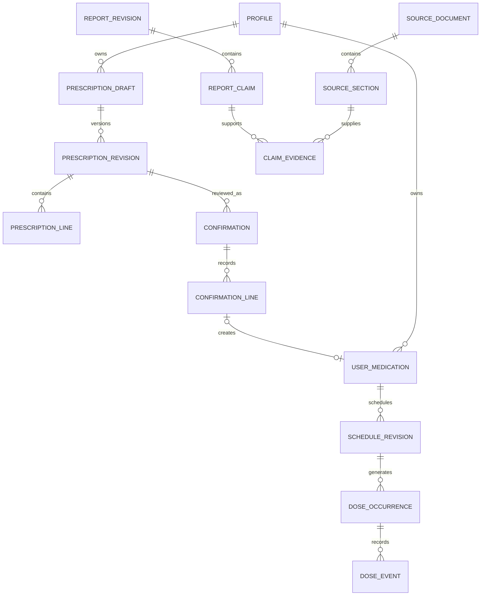

# MedLM AI database design

> Phase 1 implementation update (2026-09-24): the foundation is now implemented. See [PHASE_1_REPORT.md](PHASE_1_REPORT.md), [current API contract](contracts/openapi.json) and [scope decisions](docs/adr/0001-phase-one-boundaries.md). The remaining design below describes future behavior, not implemented clinical functionality.

Status: logical target schema; initial subset implemented in migration 0001_foundation. Date: 2026-09-24. PostgreSQL in Supabase, with separate private application and public-reference schemas. UUID primary keys, `timestamptz` for instants, `date`/`time` for local calendar rules, IANA timezone strings, exact `numeric` quantities. All mutable records carry created/updated timestamps and integer version.

## Entities

Chunk 2 migration `0003_auth_session_hardening` adds `medlm_auth.web_sessions.provider_session_id` and private `medlm_auth.auth_throttles` only. Legacy rows bind lazily after verification; auth grants now name tables explicitly. Revocation tombstones are not purged merely on access-token expiry. See [ADR 0003](docs/adr/0003-auth-session-hardening.md).

Phase 2 chunk 1: additive migration `0002_synthetic_uploads` implements only the upload/deletion metadata subset described in [ADR 0002](docs/adr/0002-phase-two-scope-and-upload-schema.md). Its six tables, trigger safeguards, owner policies and guarded downgrade are the implemented contract. The entity catalog below remains the broader target design; it does not imply these other entities exist. Phase 1 tables and runtime privileges remain unchanged.

Every personal table includes `user_id` even where derivable. Composite parent references `(user_id,parent_id)` prevent cross-owner relationships; parent tables expose unique `(user_id,id)`. All foreign keys specify an intentional delete behavior. JSONB is for versioned schemas/evidence payloads, not a substitute for ownership or relational constraints.

| Table | Main columns and relationships | Constraints / lifecycle |
| --- | --- | --- |
| profiles | user_id PK -> auth.users; locale, country=IN, time_zone, privacy_preferences | One per user; account deletion cascades personal data |
| account_access | user_id PK, disabled_at, revoked_before | Minimal access-control state; checked before all personal API access, including valid JWTs |
| revoked_sessions | auth_session_id PK, user_id, revoked_at, expires_at | Deny native session reuse through JWT lifetime; cascade with account erasure after account access is disabled |
| web_sessions | id_hash PK, user_id, encrypted refresh token, csrf_hash, expires_at, revoked_at | Server-only access; rotate on authentication/refresh |
| web_login_attempts | state_hash PK, preauth_cookie_hash, encrypted_pkce_verifier, provider, return_path, expires_at, consumed_at | Pre-auth records have no user_id yet; server-only, short-lived, single-use, no medical data |
| consent_records | id, user_id, purpose, notice_version, granted_at, withdrawn_at | Purpose-specific; minimal audit retention after erasure only if justified |
| uploads | id, user_id, object_key, object_version, checksum, mime, bytes, expires_at, retain_for_review, review_ended_at, purged_at, ticket_hash, ticket_expires_at, consumed_at, status | Object key unique; status initiated/accepted/deleting/deleted/rejected; no image bytes in PostgreSQL; processing/review object inventory tracked for purge |
| analysis_jobs | id, user_id, kind, country, locale, state, attempt, lease_until, fencing_token, model_id, pipeline_version, safe_error | Attempt >=0; cancellation/version fencing; terminal results immutable |
| identity_candidate_sets | id, user_id, analysis_id, revision, candidates JSONB, observations JSONB, review_required | Immutable candidate revision; candidates carry product IDs and source-match status separately from user review |
| identity_reviews | id, user_id, candidate_set_id, decision, selected_candidate_id nullable, reviewed_fields JSONB, confirmed_at | Immutable authenticated select/correct/reject; candidate must belong to the reviewed set; does not grant verified status |
| analysis_uploads | user_id, analysis_id, upload_id | Composite PK analysis_id/upload_id; owner-consistent FKs |
| prescription_drafts | id, user_id, analysis_id, current_revision, status | Parent for versioned transcription; no direct reminders FK |
| prescription_revisions | id, user_id, draft_id, revision, extracted_at, schema_version | Unique draft_id/revision; immutable |
| prescription_lines | id, user_id, revision_id, ordinal, fields JSONB, identity_status | Unique revision_id/ordinal; validated ExtractionField schema |
| prescription_confirmations | id, user_id, draft_id, revision_id, confirmed_at, review_schema_version | Immutable; authenticated user only |
| confirmation_lines | id, user_id, confirmation_id, line_id, disposition, confirmed_fields JSONB | Unique confirmation_id/line_id; included/excluded/unresolved; field review complete before conversion |
| market_policies | country_code, version, enabled, capabilities JSONB, source_priorities, freshness_policy | Composite PK country_code/version; active version selected by registry; IN initial policy, US and later markets additive |
| provider_market_entitlements | id, provider, country_code, license_policy_id, supported_fields/locales/categories, valid_until, enabled | Explicit coverage and license gate; clinical content sent to an LLM only if permitted |
| medicines | id, country, display_name, dosage_form, route, release_type, manufacturer, labeler | Reference product identity; do not equate manufacturer and labeler |
| ingredients | id, preferred_name, canonical_identifier | Public/licensed reference data |
| medicine_ingredients | medicine_id, ingredient_id, amount, unit, denominator_amount/unit, salt_text | Combination ingredients retained; strength values positive when present |
| medicine_identifiers | id, medicine_id, namespace, country, value | Unique namespace/country/value where source semantics guarantee product uniqueness; mapping tables for many-to-many identifiers otherwise |
| source_documents | id, provider, external_id, revision, country, language, url, source_updated_at, content_hash, retrieved_at, last_verified_at, license_policy_id | Unique provider/external_id/revision/hash; immutable content version; bounded cache per license |
| source_sections | id, document_id, locator, permitted_text, text_hash | No private patient data; excerpt retention subject to source license |
| source_license_policies | id, provider, allowed_uses, cache_ttl, redistribution, translation_rights, llm_processing_rights, derivative_output_rights, attribution_rules, reviewed_at | No ingestion, third-party model processing or publication without applicable rights |
| reports | id, user_id, current_revision_id, version, deleted_at | Stable report-group identity for API ID/ETag and owner-checked revision FK |
| report_revisions | id, user_id, report_group_id, revision, analysis_id, medicine_id nullable, status, country, locale, verified_at, stale_after, pipeline_version | Immutable revision; unique report_group_id/revision; verified status requires successful evidence check |
| report_claims | id, user_id, report_revision_id, field_key, status, value JSONB, locale, original_claim_id nullable | All REQUIREMENTS fields represented; supported claims need evidence edges |
| claim_evidence | user_id, claim_id, section_id, support_locator | PK claim_id/section_id/support_locator; source must apply to report country/product or be marked ingredient-only supplementary evidence |
| user_medications | id, user_id, medicine_id nullable, display_name, strength_text, dose_text, route_text, instructions, origin, confirmation_line_id nullable, deleted_at | Unique confirmation_line_id when present; manual and confirmed origins explicit |
| medication_instruction_revisions | id, user_id, medication_id, revision, fields JSONB, origin, reviewed_at, source_confirmation_id nullable | Immutable minimally necessary instruction snapshot; current medication and schedule reference it; source FK set null on prescription erasure |
| schedule_revisions | id, user_id, medication_id, revision, kind, schedule JSONB, time_zone, start_date, end_date, effective_at, retired_at, confirmation_id nullable | Unique medication_id/revision; at most one active revision per medication; validated discriminated schedule schema |
| dose_occurrences | id, user_id, schedule_id, occurrence_key, planned_at, original_local_time, dose_snapshot, status, snoozed_until, version | Unique schedule_id/occurrence_key; pending/taken/skipped/cancelled; unrecorded overdue is derived, not auto-skipped |
| dose_events | id (client event UUID), user_id, occurrence_id, kind, client_at, recorded_at, supersedes_event_id, note, payload | Append-only; unique event UUID + ownership check; immutable event audit under normal operations |
| unscheduled_doses | id (client event UUID), user_id, medication_id, taken_at, recorded_at, dose_text, note, supersedes_id nullable | User-reported PRN/unscheduled intake without occurrence or advice; corrections reference prior owned record; included in history/export/erasure |
| devices | id, user_id, installation_id, platform, encrypted_push_target, capability JSONB, is_primary, last_seen_at, revoked_at | Unique user_id/installation_id; partial unique user_id where primary and not revoked |
| device_schedule_acks | user_id, device_id, schedule_id, scheduled_through, ack_at, failures JSONB | Unique device_id/schedule_id; observed health only |
| notification_deliveries | id, user_id, occurrence_id, device_id, channel, schedule_revision, status, attempt, next_attempt_at, provider_message_id | Unique occurrence/device/channel/revision; queued/sent/failed/cancelled; sent != received/taken |
| outbox | id, user_id nullable, topic, aggregate_id, revision, payload_ids_only, available_at, lease_until, attempts | Unique topic/aggregate/revision; created in domain transaction; safe retry |
| idempotency_records | user_id, route, key, request_hash, encrypted_response, status, expires_at | PK user_id/route/key; 24h retention; no secret-bearing response persistence |
| sync_changes | seq bigint, user_id, entity_type, entity_id, revision, tombstone, changed_at | User-scoped monotonically ordered cursor; proposed 30-day window, older cursors force resync |
| privacy_operations | id, user_id nullable, kind, state, requested_at, completed_at, receipt_hash, safe_failure | Account erasure receipt can outlive user reference without medical content |
| exports | id, user_id, status, private_object_key, expires_at | Download expiry <=24h; revoke/delete on account deletion |
| security_audit | id, actor_pseudonym, action, resource_type, opaque_resource_id, at, outcome | No raw medical data; retention reviewed in SECURITY |

## Transaction and authorization invariants

1. API requests use a non-owner, non-BYPASSRLS database role. Set verified user context transaction-locally; never reuse pooled session-level context. `USING` and `WITH CHECK` policies restrict user_id to that context; missing context denies all rows. FORCE RLS where appropriate and test with actual runtime roles.
2. Supabase browser/native clients cannot directly access private clinical tables. Exposed schemas remain minimal. Workers get narrowly scoped grants; cross-user queue claiming uses tightly constrained functions and explicit job ownership, not general service-role credentials in request handlers.
3. Lock the current prescription revision during confirmation/conversion. Verify every selected line belongs to that revision and confirmation. Never accept a client boolean `confirmed=true` as proof.
4. Schedule activation retires previous revision, cancels future pending occurrences/deliveries, creates new occurrences/outbox and advances sync cursor atomically. Taken/skipped history and old dose snapshots do not change. Refill a bounded future horizon daily and on writes; deterministic occurrence keys permit idempotent regeneration.
5. An occurrence event uses row locking/version compare. Taken versus skipped from separate offline clients raises a reconciliation conflict; do not silently accept last-write-wins. A correction explicitly references a prior event and updates materialized status in the same transaction.
6. Evidence edges required for supported claims must be enforced by a deferred trigger or single trusted publish transaction, with integration tests; cross-row evidence requirements cannot be expressed as a simple CHECK. Report publication fails if evidence is absent or inapplicable.
7. Cancellations/account deletion fence leased workers, invalidate sessions and cancel outbox work before physical deletion. Workers recheck ownership/tombstone/fencing token immediately before publishing or sending.

8. Sync cursors must not skip a transaction that allocated a sequence value but committed later. Serialize per-user change-log allocation with a transaction-scoped lock, or use a committed-watermark protocol before exposing cursors. A bare global sequence plus `seq > cursor` is insufficient. Test overlapping commit order and tombstone replay.

9. Store market_policy_version on analyses/reports and identity_review_id on affected medication/report links. Identity review must reference the current owned candidate set; final product verification still requires source evidence. `report_group_id` references `reports.id`. Region/locale changes cannot mutate existing product country or source policy.
10. Every prescription-derived schedule is checked against its confirmed instruction snapshot at creation and replacement. Preserve the minimal dose/route/frequency/duration/food snapshot, review timestamp and instruction origin on the user medication; deleting the prescription nulls source FKs but cannot erase the fact that instructions were reviewed. A changed regimen after source deletion requires new explicit manual review. This retained medication data is disclosed as independent user-selected data and is erased with the medication/history/account as requested.

## Indexes, deletion and migrations

Index every personal table on `(user_id,id)`; histories on `(user_id,recorded_at DESC,id)`; occurrences on `(user_id,planned_at)` and pending due time; jobs/outbox on `(state/available_at,lease_until)` using partial indexes; uploads on expiry where not purged. Index FKs and source/identifier lookup keys. Avoid arbitrary JSONB indexes until query evidence warrants them.

Personal FKs cascade for account erasure. Deleting a prescription removes its text and sets medication provenance references null, retaining independent user-selected medication fields; deleting report history removes claims/evidence edges but not reusable public source records. Medication soft deletion preserves dose history by default; explicit history erasure removes it. Audit events are append-only during normal use but are not exempt from required privacy erasure.

Store transient objects separately from database backups. Database backup retention target <=30 days subject to provider plan; keep a minimal deletion ledger and replay deletions before restored data becomes accessible. Expiry/deletion jobs retry and alert. Do not assert deletion is complete while retained backups or processor copies remain within disclosed retention periods.

Alembic owns domain migrations. Use expand/backfill/validate/contract deployments, bounded backfills and rollback-compatible API versions; data restoration is not the default rollback mechanism. Test migrations from empty and prior schema, RLS cross-user isolation, restore/re-erasure and duplicate worker deliveries before release. See [PostgreSQL RLS](https://www.postgresql.org/docs/current/ddl-rowsecurity.html) and [Supabase RLS](https://supabase.com/docs/guides/database/postgres/row-level-security).
